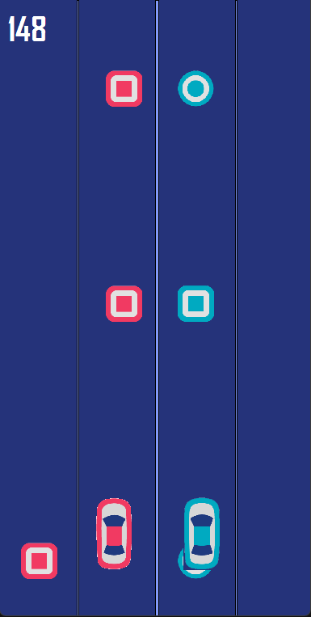

# Two Cars Game

Control both the red car and the blue car at the same time. Collect all the circles and avoid the squares on the road.

Open Visual Studio, and run the game. 

Move right car - "<" and ">" (arrows keys)
Move right car - "A" and "D"

Press "G" to start the game.
Press "R" to reset.
Press "P" to pause and resume.

My record is 148, let's see if you can break it! Good luck

## Screenshots

  &nbsp;&nbsp;
   &nbsp;&nbsp;
